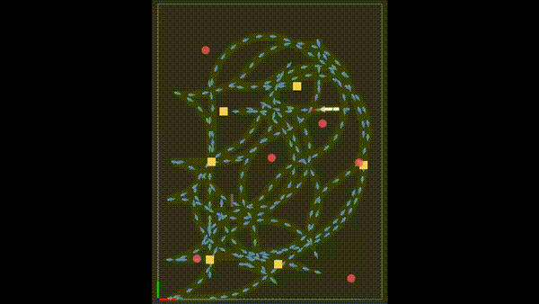

# ReloPush: Multi-object Rearrangement in Confined Spaces with a Nonholonomic Mobile Robot Pusher





## Overview
ReloPush is a multi-object rearrangement task planner incorporated with motion planners for a non-holonomic robot within a limited workspace region.

## Dependency
This version of ReloPush uses a modifed version of MuSHR RHC controller for both simulations and real robot.
[MuSHR](https://github.com/fluentrobotics/mushr)
[MuSHR RHC](https://github.com/fluentrobotics/mushr_rhc)

### Predefined Input
- Size of the workspace in rectangular shape
- Physical dimensions and the initial pose of the robot
- Physical size, possible pushing directions, the initial pose, and the goal position of each movable object (i.e. a box has four pushing directions)
- Parameters required for motion planning (i.e. nominal driving velocity, maximum turning radius, etc)

### Output
- A sequence of trajectories/actions to rearrange all movable objects to their designated positions.

## How the project files are structured

### Parameter files
To separate parameters for motion planning and others, we use two different files to contain necessary parameters:
- `include/pathPlanTools/path_planning_tools.h`: Contains parameters for motion planning
- `src/reloPush/params.cpp`: Contains other parameters

### Test data
Set of instances with random deviation from nominal test data are stored in 'testdata' folder. Each instance contains initial poses and goal positions of the movable objects, assignments of a goal to each object, and the initial pose of the robot.

### Log
Measurements are set to be saved in `log` folder.
- raw: raw data acquired as the program runs
- xlsx: re-organized raw data

### Script
- testdata_gen_from_nominal: testdata instance generator. Nominal poses are typed in the script.
- log_handler: re-organized raw data to xlsx.
- repeat: automatically repeats simulations.

## How to run

### Simulation
```
roscore # optional
roslaunch mushr_sim teleop.launch use_keyboard:=false
roslaunch mushr_rhc sim.launch
rviz -d $(roscd reloPush && pwd)/rviz/reloPush.rviz 
rosrun reloPush reloPush {test_data_filename} {data_index} {record_log} {method}
# ex) rosrun reloPush reloPush data4o.txt 0 1 proposed
```

### Real Robot
(The instructions are to be added.)


## Citing this work
```
@article{ahn2024relopush,
  title={ReloPush: Multi-object Rearrangement in Confined Spaces with a Nonholonomic Mobile Robot Pusher},
  author={Ahn, Jeeho and Mavrogiannis, Christoforos},
  journal={arXiv preprint arXiv:2409.18231},
  year={2024}
}
```

## License
This project is under [MIT](https://opensource.org/licenses/MIT) License.