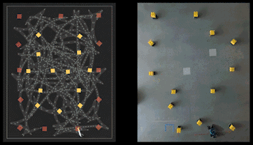

# ReloPush-BOSS: Optimization-Guided Nonmonotone Rearrangement Planning for a Car-Like Robot Pusher




## Overview
ReloPush-BOSS is multi-object rearrangement task planner incorporated with motion planners for a non-holonomic robot within a limited workspace region enforced with optimization-based relocation planning. It is an extension work of the original ReloPush with heuristic `Prerelocation`. 

## Dependency
- The planner is built with C++ STL libraries, Eigen, and OMPL.
- Qt is required for visualization UI.
- ZeroMQ is required to send the planning result to other programs.

### Predefined Input
- Size of the workspace in rectangular shape
- Physical dimensions and the initial pose of the robot
- Physical size, possible pushing directions, the initial pose, and the goal position of each movable object (i.e. a box has four pushing directions)
- Parameters required for motion planning (i.e. nominal driving velocity, maximum turning radius, etc)

### Output
- A sequence of trajectories/actions to rearrange all movable objects to their designated positions.

### Parameter files
To separate parameters for motion planning and others, we use two different files to contain necessary parameters:
- `include/PathPlanningTools.h`: Contains parameters for motion planning
- `include/Parameters.cpp`: Contains other parameters


## Citing this work
```
@ARTICLE{11397135,
  author={Ahn, Jeeho and Mavrogiannis, Christoforos},
  journal={IEEE Robotics and Automation Letters}, 
  title={ReloPush-BOSS: Optimization-Guided Nonmonotone Rearrangement Planning for a Car-Like Robot Pusher}, 
  year={2026},
  volume={},
  number={},
  pages={1-8},
  keywords={Robots;Planning;Kinematics;Collision avoidance;Search problems;Physics;Optimization;Robot kinematics;Manipulators;Clutter},
  doi={10.1109/LRA.2026.3665070}}

```
